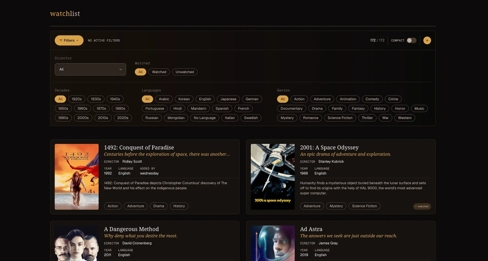

# Watchlist

A personal film tracking and display app: search TMDB, collect films into a personal watchlist, mark watched/unwatched, and browse/filter what you've saved.

**Live Demo (my personal watchlist)**: https://watchlist.mish.codes

## Why I built this

My partner and I had an endless series of "to watch" notes and docs we'd start, share, and forget about; we needed a single place to organize that list. I wanted a reliable and persistent place to keep this info that we wouldn't lose.

This project also doubled as an excuse to build some things with Postgres and Python, which I haven't had too much chance to do, and to do a proper database migration end to end: it started as flat JSON files before I migrated it to a fully normalized PostgreSQL schema.

## What it does

- **Search & add** movies via the TMDB API and save them to a personal collection
- **Browse** saved movies in a responsive grid with poster, title, and many other details
- **Filter** by genre, decade, language, watched/unwatched status, director, etc
- **Movie detail** panel with more detailed info
- **Track** watched status and who added each film. Adding and editing is auth-gated, the app is read-only when signed out

## Tech Stack

**Frontend**: Vue 3 (Composition API) · Vite · Tailwind · Vue Router · TypeScript

**Backend**: FastAPI · Pydantic · PostgreSQL (psycopg3) · `uv` for env/deps

**Infra**: Docker Compose (local dev) · Railway (client + API + Postgres + volume for poster images) · Caddy

## Architecture

- **Normalized Postgres schema** - movies plus join tables for genres, languages, and a `people` / `movie_people` table covering cast and crew (directors, writers, source authors)
- **Raw SQL, no ORM** - queries are hand-written SQL through psycopg3 rather than an ORM, a deliberate choice for the sake of simplicity and ability to work directly with the relational model
- **Type-safe across the stack** - Pydantic models are the source of truth; frontend generates TypeScript types from the generated OpenAPI schema so API and client stay in sync
- **Hand-written migrations** - Numbered SQL files with a small runner script that tracks applied migrations
- **TMDB integration** - keyword search with a server-side allowlist determining what is imported on add
